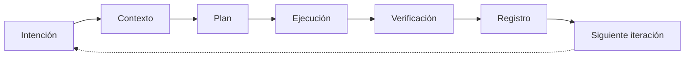

# Vol 01 · Modelo de Trabajo

> Volumen previo: — · Siguiente: [Vol 02 · Subagentes](./vol-02-subagentes.md)

## Las 4 Capas

La diferencia entre usar IA como chat y usarla como sistema de trabajo no
está en escribir prompts más largos. Está en que cada interacción tenga
estructura.

**Capa 1 — Contexto.** Lo que la IA debe saber antes de actuar. No es un
dump de información — es la porción del proyecto que el agente necesita
para actuar sin suponer. Sin contexto, el agente optimiza para la respuesta
más razonable en abstracto, que no es necesariamente la correcta para este
proyecto.

**Capa 2 — Tarea.** Lo que debe producir ahora. La tarea tiene alcance
acotado, criterios de salida verificables y un propietario claro. Una tarea
que dice "mejorá lo que veas" no es una tarea — es una delegación ciega.

**Capa 3 — Verificación.** Cómo se sabe que el resultado sirve. Un resultado
que no se puede probar no es un resultado cerrado — es un supuesto que se
integra con confianza falsa. La verificación es ejecutable: un comando, un
test, una revisión contra una spec.

**Capa 4 — Memoria.** Dónde queda registrado para no repetir el mismo
razonamiento. La memoria no vive en el chat — vive en archivos. Sin esta
capa, cada sesión empieza de cero.

---

## Ciclo de Trabajo

**Intención:** El resultado deseado en una frase verificable. Si al terminar
no podés contrastarla contra lo producido, la intención estaba mal definida.

**Contexto:** La porción del proyecto que el agente necesita para este
trabajo. Cada sesión nueva empieza desde lo que está escrito, no desde lo
que se recordó.

**Plan:** Lista de 3 a 7 pasos concretos con archivos afectados y criterio
de salida por paso. Evita trabajo impulsivo.

**Ejecución:** Un cambio a la vez, ownership explícito, sin saltear pasos.

**Verificación:** Comando que corre, test que pasa, output que matchea un
criterio.

**Registro:** Mover el conocimiento del chat al repositorio — decisiones,
gaps, estado actualizado. Es la capa que más se saltea y la que hace que el
trabajo sea acumulable.

**Siguiente iteración:** Con el registro hecho, la próxima sesión avanza
desde el último estado conocido.

---

## Unidad Mínima de Contexto

| Campo | Para qué sirve | Nota |
|---|---|---|
| Objetivo | Evita que el agente optimice otra cosa | Una frase verificable |
| Estado actual | Da el punto de partida real | Qué existe hoy, no qué debería existir |
| Restricciones | Acota las soluciones | Qué no se puede tocar, cambiar o asumir |
| Archivos relevantes | Reduce exploración ciega | Rutas concretas, no carpetas enteras |
| Criterios de aceptación | Define el cierre | Qué tiene que ser verdad al terminar |
| Verificación | Obliga a probar | El comando o test que confirma |
| Riesgos | Hace visible lo delicado | Lo que podría romperse si se improvisa |

**Escala mínima por tipo de tarea:**

| Tipo | Campos obligatorios |
|---|---|
| Exploración | Objetivo + Archivos + Restricciones (solo lectura) |
| Corrección puntual | Objetivo + Archivos + Verificación |
| Implementación | Todos los campos |
| Documentación | Objetivo + Archivos + Salida esperada |
