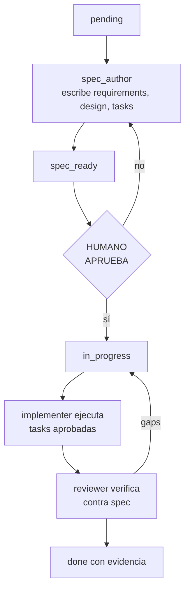

# Vol 03 · Specification-Driven Development

> Anterior: [Vol 02 · Subagentes](./vol-02-subagentes.md) · Siguiente: [Vol 04 · Arquitectura de repo](./vol-04-arquitectura-repo.md)

## Flujo SDD

SDD garantiza que la IA ejecuta lo que el humano aprobó — no lo que
interpretó. Los roles que sostienen este flujo (`spec_author`,
`implementer`, `reviewer`) están definidos en [Vol 09 · Roles cerrados de
harness](./vol-09-roles-cerrados.md).



**requirements.md** — Qué necesidad existe y cómo debe comportarse el
sistema. Usa formato EARS.

**design.md** — Qué archivos se tocan, qué decisiones se toman, qué
alternativas se descartan y por qué, qué queda fuera del alcance.

**tasks.md** — Lista ejecutable con trazabilidad a requirements:

```text
- [ ] T1 — [descripción]. Cubre: R1.
- [ ] T2 — [descripción]. Cubre: R1, R2.
```

**Formato de aprobación:**

```text
Estado: aprobado
Aprobado por: [nombre]
Fecha: [fecha]
Alcance aprobado: R1, R2, R3
Condición de cierre: todos los R con test verde y build limpio
```

Si cambia el alcance después de aprobar, el estado vuelve a `spec_ready`.

---

## Fases vs Slices

Dos escalas de planificación simultáneas.

**Fase** — escala global. Agrupa una capacidad completa que lleva el sistema
a un estado cualitativamente distinto. Tiene estado visible, cierra con
evidencia (build + tests + tag opcional).

**Slice** — escala granular. La parte más pequeña implementable, verificable
y mergeable de forma independiente. Cubre uno o más requirements.

```text
Fase 2 — Motor de reglas
  ├── Slice 2.1 — YAML rule catalog
  ├── Slice 2.2 — Rule evaluator
  ├── Slice 2.3 — Clasificación guiada por reglas
  └── Slice 2.4 — Reporter agrupado por regla

Fase 2.5 — Enrichment (diferida de Fase 2)
  └── Slice 2.5.1 — HttpMethod enricher
```

**Estado visible de fases** (en README o PROGRESS.md):

```markdown
| Fase | Descripción | Estado | Tests |
|---|---|---|---|
| Fase 1 | Capacidad base | ✅ Completa | 87 passed |
| Fase 2 | Motor de reglas YAML | ✅ Completa | 270 passed |
| Fase 2.5 | Enrichment HTTP | 🔄 En progreso | — |
| Fase 3 | Threat Intelligence | ⏳ Pendiente | — |
```

**Versionado** — posibilidad, no norma. Cuando se usa:
`v[major].[fase].[patch]` por fase, o semántico si hay API pública. Lo
importante: el tag representa un estado real (build + tests verdes).

**Gaps entre fases** — al cerrar una fase, los ítems diferidos quedan
registrados explícitamente con motivo. Ver [Vol 06](./vol-06-gap-tracking.md).

---

## EARS — Requirements Verificables

| Patrón | Forma |
|---|---|
| Ubicuo | El sistema DEBE `[acción]`. |
| Evento | CUANDO `[evento]`, el sistema DEBE `[acción]`. |
| Estado | MIENTRAS `[condición]`, el sistema DEBE `[acción]`. |
| Opcional | DONDE `[feature activa]`, el sistema DEBE `[acción]`. |
| No deseado | SI `[situación no deseada]` ENTONCES el sistema DEBE `[acción]`. |

**Reglas:** ID estable por requirement (R1, R2...). Verificable con un test.
Un solo DEBE por requirement. Sin verbos blandos. Cada R mapea a al menos un
test en tasks.md.

**Ejemplo:**

```text
R1: CUANDO el sistema arranca, DEBE cargar todas las reglas YAML del directorio configurado.
R2: CUANDO un WafEvent llega al analyzer, el sistema DEBE evaluar todas las reglas en orden de prioridad.
R3: SI una regla tiene formato inválido ENTONCES el sistema DEBE lanzar YamlRuleCatalogException al arrancar.
```

---

## Checklist de Cierre

**Slice:**

- [ ] Requirement escrito con ID estable.
- [ ] Spec define comportamiento verificable.
- [ ] Alcance excluye explícitamente lo que no entra.
- [ ] Decisiones relevantes en design.md.
- [ ] Tasks con trazabilidad a requirements.
- [ ] Criterios de aceptación concretos y verificables.
- [ ] Cada requirement tiene al menos un test.
- [ ] Tests pasan (comando ejecutado).
- [ ] Sin contradicciones entre spec, código y tests.
- [ ] Gaps nuevos registrados.

**Fase (todo lo anterior más):**

- [ ] Build de release limpio.
- [ ] Tests de regresión de fases anteriores verdes.
- [ ] Gaps diferidos registrados con motivo.
- [ ] `PROGRESS.md` actualizado.
- [ ] Tag creado (si corresponde).
- [ ] Release notes escritas (si corresponde).

Señales de que el cierre NO está listo: "funciona pero no corrí los tests",
"el doc lo actualizo después", "el gap está en mi cabeza".
