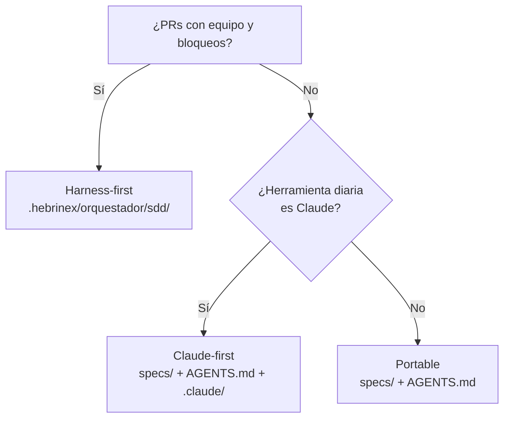

# Vol 04 · Arquitectura de Repo

> Anterior: [Vol 03 · SDD](./vol-03-sdd.md) · Siguiente: [Vol 05 · Prompts](./vol-05-prompts.md)

## Mapa de Responsabilidades

| Archivo / Carpeta | Audiencia | Responsabilidad | NO es para |
|---|---|---|---|
| `README.md` | Personas nuevas | Presentar el proyecto, instalación y uso rápido | Detalle de arquitectura, reglas de agente |
| `AGENTS.md` | Agentes de código | Reglas operativas, mapa de rutas, comandos, permisos, cierre | Landing page, visión de producto |
| `PROGRESS.md` | Equipo + agentes | Estado de fases/slices, gaps activos, roadmap | Documentación técnica |
| `.github/copilot-instructions.md` | GitHub Copilot | Instrucciones generales de estilo y contexto | Repetir lo que ya está en AGENTS.md |
| `.github/prompts/*.prompt.md` | Equipo y asistentes | Comandos reutilizables para tareas que se repiten | Documentación del sistema |
| `.github/workflows/*.yml` | CI/CD | Automatización ejecutable | Documentar cosas |
| `specs/<feature>/` | Equipo + agentes | Requirements, design, tasks | Código, documentación de usuario |
| `progress/current.md` | Agentes | Estado vivo de la sesión activa | Historial permanente |

**Regla de oro:** Un archivo de contexto no finge que ejecuta. Un workflow
ejecuta. Un catálogo documenta. Un prompt orienta. Un AGENTS.md gobierna.
Mantener esa separación evita sistemas confusos.

**Estructura mínima por escala:**

Chico (script / herramienta):

```text
repo/ → AGENTS.md · README.md · src/ · tests/ · .github/workflows/ci.yml
```

Mediano (servicio con fases):

```text
repo/ → + PROGRESS.md · docs/ · specs/<feature>/ · .github/prompts/
```

Grande (sistema multi-módulo):

```text
repo/ → + .github/instructions/ · progress/current.md · progress/history/
```

---

## La Carpeta `orquestador/`

`orquestador/` es la **casa del sistema operativo del repo**. En
`Hebri-AI-Harness 0.8.9`, la ruta operativa canónica es
`.hebrinex/orquestador/`. Las carpetas de herramienta (`.github/`, `.claude/`,
etc.) pueden aportar prompts o adaptadores, pero no reemplazan esa fuente de
verdad.

Convención recomendada:

```text
.hebrinex/orquestador/
  README.md         índice del sistema operativo del repo
  harness-manifest.txt estructura validada por init.sh
  context/          contexto estable (product.md, architecture.md)
  sdd/              specs, progress y trace
  method/           contrato, modos, gates y protocolo multiagente
  policies/         permisos, seguridad, criterios de riesgo
```

**Regla:** no duplicar. Si el equipo usa GitHub Copilot, mantener
`.github/prompts/` para compatibilidad con la herramienta y dejar
`.hebrinex/orquestador/` como autoridad. Si se usa otro agente
(Claude Code, Cursor, Gemini), agregar la capa propia de ese agente sin mover
ni copiar el contenido del orquestador.

**Importante:** "orquestador" es el nombre de la **carpeta**, no del rol.
El rol que pivotea entre subagentes se llama `leader` y está definido en
[Vol 09](./vol-09-roles-cerrados.md).

---

## Fuente de Verdad

El problema de trabajar con múltiples herramientas (GitHub, Claude, Copilot,
CI) es que cada una tiene su capa de configuración. Si no se define dónde
vive la fuente de verdad, el contexto se duplica y las capas entran en
contradicción.

**El principio:** La fuente de verdad es una sola carpeta. Las demás capas
son conectores que apuntan a esa fuente — nunca la reemplazan ni la duplican.

```text
FUENTE DE VERDAD
   specs/              ← una sola, siempre

CONECTORES (apuntan a la fuente, no la duplican)
   .github/workflows/ci.yml       → ejecuta dotnet test
   .github/prompts/plan.prompt.md → dice "leer specs/<feature>/"
   AGENTS.md                      → dice "antes de implementar: leer specs/"
```

Cambiar de herramienta no mueve la verdad — solo reemplaza el conector.

**Árbol de decisión:**



**Regla de migración:** Al cambiar la fuente de verdad, mover el contenido
completo, dejar un `MOVED.md` en la carpeta vieja, actualizar AGENTS.md. No
mantener dos carpetas activas con contenido diferente.

---

## Cómo Escribir un Buen AGENTS.md

AGENTS.md es el mapa operativo para agentes. Debe funcionar como mapa, no
como enciclopedia.

**Debe responder:**

1. Cuál es el stack.
2. Dónde está cada cosa importante (rutas, no descripciones vagas).
3. Qué comandos se usan para instalar, probar, validar y correr.
4. Qué archivos o carpetas son delicados.
5. Qué estilo de cambios se espera.
6. Qué está prohibido tocar.
7. Cómo cerrar una tarea (qué evidencia se espera).

**Error más común:** AGENTS.md filosófico. "Usar buenas prácticas" no es una
regla. Un agente necesita comandos, rutas, límites y criterios concretos.

**Template base:**

```markdown
# AGENTS.md

## Stack
- Lenguaje: [...] · Framework: [...] · Tests: [...]

## Comandos
- Tests: `[comando]`
- Build: `[comando]`
- Validar todo: `[comando]`

## Mapa
| Ruta | Contenido | Cuándo leer |
|---|---|---|
| `specs/` | Requirements, design, tasks | Antes de implementar |
| `PROGRESS.md` | Estado de fases y gaps | Siempre al arrancar |

## Reglas
- No tocar código antes de spec aprobada.
- No declarar done sin tests verdes y build limpio.
- Si un comando falla, reportar el error exacto antes de continuar.

## Cierre
Antes de declarar done: archivos modificados · comando ejecutado + resultado · gaps nuevos.
```

---

## Stacks

### .NET

Comandos estándar:

```powershell
dotnet restore
dotnet build
dotnet build -c Release                                    # cierre de fase
dotnet test
dotnet test --filter "FullyQualifiedName~[NombreClase]"   # subset
```

Estructura recomendada:

```text
src/
  Solucion.Core/        ← modelos, interfaces, contratos
  Solucion.Domain/      ← lógica de dominio
  Solucion.Analyzers/   ← componentes de análisis
  Solucion.Worker/      ← punto de entrada / host
tests/
  Solucion.Core.Tests/
  Solucion.Analyzers.Tests/
  Solucion.Integration.Tests/
```

Naming de tests: `[Cuando]_[Resultado]` → `WhenRuleMissing_ClassifiesAsUnclassified`

Cierre de fase:

```powershell
dotnet test && dotnet build -c Release
git tag -a v[versión] -m "Fase [N] — [descripción]"
git push origin main v[versión]
```

### Python

Comandos estándar:

```bash
pip install -r requirements.txt
pytest
pytest -k "test_nombre"
mypy src/
ruff check src/ tests/
```

Naming de tests: `test_when_[condicion]_[resultado]`

### YAML como lenguaje de dominio

Aplica cuando las reglas de negocio viven en archivos YAML y tienen su
propio ciclo de vida (se agregan, modifican y deshabilitan independientemente
del código).

**El motor debe fallar al arrancar, no en runtime.** Una regla inválida debe
lanzar excepción con nombre de archivo y error antes de procesar eventos.

Estructura mínima de una regla:

```yaml
id: sql-injection-basic
description: Detecta patrones básicos de SQL injection en el body
enabled: true
priority: 100
bucket: SqlInjection
action: Block
conditions:
  - field: RequestBody
    operator: contains
    value: "SELECT"
```

Tests: usar reglas inline en el test, no depender de archivos en disco.
Cubrir match, no-match, campo nulo.

Gaps comunes: operadores faltantes (regex, notContains), sin validación de
schema, sin hot-reload, sin versionado del catálogo, precedencia no definida
cuando varias reglas matchean.
