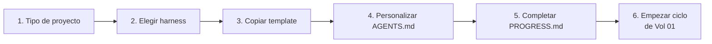

# Vol 07 · Acoplamiento con Harness

> Anterior: [Vol 06 · Gap tracking](./vol-06-gap-tracking.md) · Siguiente: [Vol 08 · MCPs y autonomía](./vol-08-mcps-y-autonomia.md)

## Cómo Definir el Tipo de Proyecto

Antes de crear cualquier archivo, responder estas preguntas. Un proyecto
que hoy parece pequeño puede volverse monumental — la estructura inicial
debe soportar ambas escalas.

**1. ¿Cuál es el objetivo principal?** Una frase que describe qué resuelve
y para quién.

**2. ¿Qué stack?** Lenguaje + versión, framework, herramienta de test,
build/packaging.

**3. ¿Solo o en equipo?** Solo → más flexibilidad. Equipo → SDD estricto,
fuente de verdad en repo.

**4. ¿Cuál es la escala esperada?**

| Escala | Descripción | Estructura inicial |
|---|---|---|
| Chico | Script, herramienta simple | AGENTS.md + README + src + tests |
| Mediano | Servicio con 2-4 capacidades | + specs/ + PROGRESS.md + docs/ |
| Grande | Sistema con múltiples módulos | + .github/ completo + progress/ |
| No sé | Empezar con mediano | Igual que mediano |

**5. ¿Hay reglas de dominio configurables?** YAML rules, políticas
declarativas → agregar `config/rules/` + leer Vol 04 · YAML domain.

**6. ¿Hay integraciones externas?** APIs, bases de datos, servicios
externos. Identificarlas al inicio.

**7. ¿Qué CI/herramienta principal?** GitHub Actions → GitHub-first. Claude
diario → Claude-first. Sin preferencia → Portable.

**Output de esta sesión antes de escribir código:**

1. `AGENTS.md` inicial con stack, comandos y reglas.
2. `README.md` con descripción y estructura.
3. `PROGRESS.md` con primera fase o slices.
4. Lista de gaps iniciales (de la biblioteca [Vol 06](./vol-06-gap-tracking.md)).
5. Estructura de carpetas inicial.

---

## La Biblia y el Harness

**Esta biblia aporta:** el modelo mental, el proceso, las convenciones por
stack, la biblioteca de gaps, los formatos.

**El harness template aporta:** la estructura de carpetas lista para copiar,
AGENTS.md base pre-cargado, templates de specs, prompts pre-cargados,
scripts de setup.

El template implementa la biblia. Si hay conflicto, la biblia gana.

**Flujo de arranque:**



En el AGENTS.md del proyecto, agregar referencia:

```markdown
## Metodología
Este proyecto sigue Hebri-AI-Structure: [link al repo]
```

No copiar el contenido de la biblia al proyecto — referenciarla.

---

## Gaps activos de este volumen

### Gap H-01 — Harness template aún no existe

**Estado:** Identificado · **Capa:** Docs

**Descripción:** El presente volumen describe cómo acoplar un harness al
flujo de Hebri-AI-Structure, pero el repositorio `Hebri-AI-Harness` con la
estructura ejecutable (AGENTS.md base, `specs/` templates, prompts,
workflows, scripts de setup por stack) todavía no fue creado.

**Contexto:** El template implementa la biblia. Sin él, cada proyecto nuevo
tiene que reconstruir manualmente la estructura inicial — lo cual
contradice el principio de no repetir el mismo razonamiento.

**Motivo de diferimiento:** El primer hito del proyecto fue dejar la
metodología documentada y estable (v2.0.0). El harness se aborda como
proyecto siguiente, con su propio SDD y fases.

**Destino:** Repositorio independiente `Hebri-AI-Harness`. Cuando exista,
se enlazará desde este volumen y se marcará el gap como resuelto.

**Resuelto por:** —
