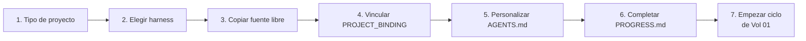

# Vol 07 · Acoplamiento con Harness

> Anterior: [Vol 06 · Gap tracking](./vol-06-gap-tracking.md) · Siguiente: [Vol 08 · MCPs y autonomía](./vol-08-mcps-y-autonomia.md)

## Cómo Definir el Tipo de Proyecto

Antes de crear cualquier archivo, responder estas preguntas. Un proyecto
que hoy parece pequeño puede volverse monumental — la estructura inicial
debe soportar ambas escalas.

**1. ¿Cuál es el objetivo principal?** Una frase que describe qué resuelve
y para quién.

**2. ¿Qué stack?** Lenguaje + versión, framework, herramienta de test,
build/packaging.

**3. ¿Solo o en equipo?** Solo → más flexibilidad. Equipo → SDD estricto,
fuente de verdad en repo.

**4. ¿Cuál es la escala esperada?**

| Escala | Descripción | Estructura inicial |
|---|---|---|
| Chico | Script, herramienta simple | AGENTS.md + README + src + tests |
| Mediano | Servicio con 2-4 capacidades | + specs/ + PROGRESS.md + docs/ |
| Grande | Sistema con múltiples módulos | + .github/ completo + progress/ |
| No sé | Empezar con mediano | Igual que mediano |

**5. ¿Hay reglas de dominio configurables?** YAML rules, políticas
declarativas → agregar `config/rules/` + leer Vol 04 · YAML domain.

**6. ¿Hay integraciones externas?** APIs, bases de datos, servicios
externos. Identificarlas al inicio.

**7. ¿Qué CI/herramienta principal?** GitHub Actions → GitHub-first. Claude
diario → Claude-first. Sin preferencia → Portable.

**Output de esta sesión antes de escribir código:**

1. `AGENTS.md` inicial con stack, comandos y reglas.
2. `README.md` con descripción y estructura.
3. `PROGRESS.md` con primera fase o slices.
4. Lista de gaps iniciales (de la biblioteca [Vol 06](./vol-06-gap-tracking.md)).
5. Estructura de carpetas inicial.

---

## La Biblia y el Harness

**Esta biblia aporta:** el modelo mental, el proceso, las convenciones por
stack, la biblioteca de gaps, los formatos.

**El harness operativo aporta:** la estructura de carpetas lista para copiar,
AGENTS.md base pre-cargado, templates de specs, prompts pre-cargados,
scripts de setup, estado estructurado y controles de aprobación.

El harness implementa la biblia. Si hay conflicto, se registra el gap y se
decide si corresponde corregir la biblia, el harness o ambos.

El repositorio operativo del harness vive separado:
[Hebri-AI-Harness](https://github.com/HebrineX/Hebri-AI-Harness).

La separación importa:

| Repo | Responsabilidad | Cambia cuando |
|---|---|---|
| `Hebri-AI-Structure` | Criterio, metodología, patrones | Cambia el modo de pensar o decidir |
| `Hebri-AI-Harness` | Archivos, prompts, registry, locks, scripts | Cambia la operación concreta |

No copiar el harness dentro de la biblia ni copiar la biblia dentro del
harness. Se enlazan y evolucionan juntos, pero versionados por separado.

Un harness preparado para producción no es solo una carpeta de prompts.
Debe traer contratos operativos mínimos:

- binding de proyecto para distinguir fuente libre de harness vinculado;
- modos de operación (`manual` y `automático`);
- contrato de sesión obligatorio;
- resolución estricta de `.hebrinex` por proyecto;
- re-entry obligatorio después de compactación o cambio de proyecto;
- independencia técnica y anti-confirmation bias;
- límite de concurrencia y registry de agentes;
- roles mínimos con perfiles parametrizados;
- locks de ownership antes de escribir;
- gates binarios por ciclo o slice;
- clarification gate, analysis checklist y blast radius;
- task graph para slices, dependencias y waves;
- preflight y approval envelope antes de efectos;
- state y registry estructurados;
- audit trail y evidencia verificable;
- auditor, reporter y detractor pass para decisiones importantes;
- cierre explícito de agentes;
- handoffs por archivo;
- políticas de permisos, riesgo y recuperación;
- guía de AI Engineering para prompts, modelos, tools, retries, validación,
  cache y observabilidad.
- manifest estructural para que la validación no dependa de listas duplicadas
  en scripts.
- presupuestos explícitos de contexto para que el ahorro de tokens sea
  verificable y no aspiracional;
- validador local con pruebas negativas para detectar drift antes de migrar o
  cerrar versión;
- memoria estratificada local, diaria, de ciclo, de proyecto y completa;
- entrypoints de primer mensaje, re-entry liviano/completo, debug-log intake y recuperación post-compactación;
- adapters por IA para Codex, Claude Code, Gemini, Qwen, DeepSeek, Cursor, Copilot y herramientas genéricas.
- exclusion material de documentacion personal/local del harness operativo y
  de las copias `bound`.
- Agent Contract System para que los agentes existan por contrato verificable,
  no por prompt;
- runtime enablement por rol: perfiles runtime, context packs, tool packs,
  playbooks, failure modes y rubrics;
- seguridad informática verificable: permisos, command risk, write scope,
  red, secretos, supply chain, logging, threat model y escalación;
- servicio de migración con rutas `0.9.0 -> 0.10.0`, `0.8.10 -> 0.10.0`,
  `0.10.11 -> 0.11.0`, `0.11.0 -> 0.12.0`, `0.12.0 -> 0.13.0` y
  `0.13.0 -> 0.14.0`, modo
  CheckOnly sin escrituras, Apply con backup y contrato post-migración aplicado;
- enforcement ejecutable para state machine, agent runtime, approval store,
  Command Gateway y hooks reales del host cuando la herramienta los soporte.

**Flujo de arranque:**



En el AGENTS.md del proyecto, agregar referencia:

```markdown
## Metodología
Este proyecto sigue Hebri-AI-Structure: [link al repo]
```

No copiar el contenido de la biblia al proyecto — referenciarla.

---

## Binding de proyecto y anti-contaminación

Desde `Hebri-AI-Harness 0.10.0`, el harness ya no se trata como una carpeta
genérica reutilizable en vivo. Cada proyecto debe operar con su propio
`.hebrinex/` interno.

Estados conceptuales:

| Estado | Uso permitido | Uso prohibido |
|---|---|---|
| `source_template` | Fuente libre para copiar, auditar o editar el repo del harness | Operar un proyecto consumidor desde esa carpeta |
| `bound` | Operar el proyecto cuyo `project_root` coincide | Operar otro proyecto o recibir estado ajeno |

Reglas:

- Si el proyecto tiene `.hebrinex/`, se valida su binding antes de operar.
- Si no tiene `.hebrinex/`, se busca una fuente local libre y se copia al
  proyecto.
- Si no existe fuente local libre, se baja el repo del harness y se vincula.
- Un harness externo nunca es autoridad operativa del proyecto activo.
- La copia hacia un proyecto excluye documentacion personal/local, `.git/` y
  temporales.
- `scripts/validate-harness.ps1 -RunNegativeTests` debe pasar antes de dar por
  sana una migración.
- Specs, registry, locks, gates y reportes viven solo en el `.hebrinex/`
  vinculado al proyecto.

Esto evita que una sesión compactada o un cambio de carpeta escriba estado de
un proyecto dentro del harness de otro.

---

## Memoria estratificada gobernada por orquestador

Desde `Hebri-AI-Harness 0.10.0`, el problema de foco no se resuelve confiando
en la memoria interna de cada IA. Se resuelve con memoria externa en archivos,
marcada por el orquestador.

| Capa | Uso | Carga por defecto |
|---|---|---:|
| `local` | contrato activo, session pin, foco actual | sí |
| `daily` | decisiones y errores del día | sí, si aplica |
| `cycle` | fase/slice, roles, locks, approvals y gates | si hay ciclo activo |
| `project` | hechos estables, arquitectura y decisiones vigentes | por perfil |
| `complete` | auditoría global, migración o reconstrucción histórica | no |

Regla: el modelo no decide libremente qué recordar. Lee
`memory-registry.yaml`, aplica `memory-routing.yaml` y carga sólo las capas
habilitadas por el orquestador.

La memoria completa requiere motivo, alcance y aprobación cuando implica
lectura amplia o un cierre derivado de historia.

El presupuesto de contexto vive en `orquestador/context-budget.yaml`. Si un
entrypoint supera su presupuesto (`memory_bootstrap`, `first_message`,
`debug_log_intake`, `leader_light`, etc.), el agente debe detenerse, declarar
el exceso y pedir un brief más acotado o aprobación explícita para contexto
completo.

---

## Harness mínimo recomendado

```text
.hebrinex/
  PROJECT_BINDING.yaml
  AGENTS.md
  PROGRESS.md
  init.sh
  scripts/
    validate-harness.ps1
  prompts/
  agents/
  orquestador/
    harness-manifest.txt
    context-budget.yaml
    context-profiles.md
    context/
    memory/
      memory-registry.yaml
      memory-routing.yaml
      local/session-pin.md
      daily/
      cycle/
      project/
      complete/
    entrypoints/
      first-message.md
      reentry-light.md
      reentry-full.md
      debug-log-intake.md
      compactation-recovery.md
    adapters/
      generic-ai.md
      codex.md
      claude-code.md
      gemini.md
      qwen.md
      deepseek.md
    agents/
      agent-registry.yaml
      capability-registry.yaml
      lifecycle-registry.yaml
      model-adapter-profiles.yaml
      role-contracts/
      security-profiles/
      runtime-profiles/
      context-packs/
      tool-packs/
      playbooks/
      failure-modes/
      evaluation-rubrics/
      handoff-contracts/
    security/
      permission-registry.yaml
      command-risk-registry.yaml
      write-scope-registry.yaml
      network-policy.yaml
      secrets-policy.yaml
      supply-chain-policy.yaml
      escalation-policy.yaml
      logging-policy.yaml
      threat-model.yaml
    migration/
      migration-registry.yaml
      versions/
      contracts/
      reports/
    method/
      session-contract.md
      harness-resolution.md
      evidence-reconstruction.md
      changelog-policy.md
      deploy-migration-policy.md
      reference-drift-policy.md
      ci-pipeline-policy.md
      backlog-policy.md
      audit-reporting-policy.md
      final-report-evidence-policy.md
      ai-preset-policy.md
      memory-layer-policy.md
      adapter-contract.md
      context-loading-policy.md
      operating-modes.md
      multiagent-protocol.md
      agent-role-taxonomy.md
      ai-engineering.md
    policies/
      tool-policy.yaml
      command-taxonomy.md
      write-set-policy.md
      secret-denylist.md
      schemas/
        project-binding.schema.yaml
        context-budget.schema.yaml
        memory-registry.schema.yaml
        registry.schema.yaml
    sdd/
      specs/
      progress/
        state.yaml
        registry.yaml
        registry.md
        blocked.md
        approvals/
        locks/
        cycles/
          _template/
            audit.jsonl
            gate-log.yaml
        templates/
          approval-envelope.md
          preflight-template.md
          reentry-checklist.md
          clarification-checklist.md
          analysis-checklist.md
          blast-radius.md
          task-graph.yaml
          agent-profile-template.yaml
          detractor-pass.md
          changelog-reconstruction-checklist.md
          release-history-matrix.yaml
          deploy-migration-checklist.md
          reference-drift-matrix.yaml
          ci-pipeline-history.yaml
          backlog-classification-matrix.yaml
          audit-report-contract.md
          final-report-crosslink-checklist.md
          ai-preset-contract.md
          memory-closure-checklist.md
          verification-matrix.yaml
          final-report.md
          agent-closure.md
```

En la implementación vigente del harness, el orquestador operativo vive en
`.hebrinex/orquestador/`. Las carpetas de herramienta como `.github/` o
`.claude/` pueden contener prompts o adaptadores, pero no reemplazan esa fuente
de verdad para specs, progreso, permisos y handoffs.

---

## Protocolo de evolución Biblia ↔ Harness

Cuando una sesión real revela una fricción:

1. Registrar el gap donde apareció: normalmente en el harness o en el
   `PROGRESS.md` del proyecto.
2. Decidir si el problema es operativo o metodológico.
3. Si es operativo, cambiar `Hebri-AI-Harness`.
4. Si es conceptual, cambiar `Hebri-AI-Structure`.
5. Si afecta a ambos, cambiar primero la biblia y después reflejarlo en el
   harness.
6. Cerrar el gap con referencia al commit, PR o versión que lo resolvió.

**Regla:** el harness no inventa metodología nueva en silencio. Si una regla
operativa nueva demuestra ser general, vuelve a la biblia.

---

## Gaps activos de este volumen

### Gap H-01 — Harness operativo publicado, pendiente de validación piloto

**Estado:** Publicado · En validación piloto · **Capa:** Docs

**Descripción:** El presente volumen describe cómo acoplar un harness al
flujo de Hebri-AI-Structure. Ya existe una materialización publicada como
repo independiente. La referencia operativa actual es
`Hebri-AI-Harness 0.16.0`, que agrega binding de proyecto, resolución estricta
del harness, re-entry post-compactación, contrato de sesión, controles P0
estructurados, state/registry YAML, preflight, approval envelope, policies
deny-by-default, audit trail, gate logs, cierre explícito de agentes,
anti-confirmation bias, roles mínimos con perfiles parametrizados, auditor,
reporter, detractor pass, clarification gate, analysis checklist, blast radius,
task graph, gates de evidencia histórica, deploy/migración, drift de
referencias, CI/pipeline, backlog, cierre con cross-links, adapters multi-IA,
entrypoints de re-entry, memoria estratificada gobernada por orquestador,
manifest estructural, presupuestos de contexto, validador local,
compatibilidad PowerShell 5.1 para el builder de instrucciones,
regularizadores de migración para `state.yaml` y `registry.yaml`, prompts
ordenados por responsabilidad, registries canónicos del orquestador, índice
de registries, Agent Contract System, seguridad informática verificable,
servicio de migración con contrato post-migración aplicado, enforcement de
runtime, approval store ejecutable, Command Gateway con approval enforcement,
hooks reales de Claude Code, adapters condensados por shared core, daemon MCP
local, fuente única de roles generada desde `agents/<rol>.md` y medicion
ejecutable de uso de tokens/costo con ahorro conservador reportado del 90%.
Desde 0.10.0 esos controles separan definitivamente harness y agente: el
harness define, limita y audita; los agentes ejecutan contratos registrados
por rol. Desde 0.12.0, además, el `SI` deja de ser sólo texto conversacional y
se materializa como envelope verificable por el gateway.
Desde 0.13.0, los clientes MCP pueden invocar el enforcement sin saltear
gateway, approvals, gates ni cierre de ciclo.
Desde 0.14.0, el ahorro de contexto deja de ser declarativo: `hebrinex usage`
mide `savings_docs_pct` contra la documentacion operativa completa y
`validate-release.ps1` bloquea drift del claim del README.
Desde 0.15.0, locks, approvals, gateway, hooks y MCP endurecen autonomia con
controles ejecutables.
Desde 0.16.0, el harness agrega integraciones host, role agents nativos
derivados y backends MCP de agentes sin transferir autoridad al modelo.

**Contexto:** El template implementa la biblia. Sin él, cada proyecto nuevo
tiene que reconstruir manualmente la estructura inicial — lo cual
contradice el principio de no repetir el mismo razonamiento.

**Motivo de diferimiento:** El harness ya existe y evolucionó hasta 0.16.0.
El trabajo pendiente es validarlo en proyectos reales y retroalimentar la
biblia con fricciones repetidas.

**Destino:** [Hebri-AI-Harness](https://github.com/HebrineX/Hebri-AI-Harness).
Cuando pase validación piloto, se marcará como resuelto.

**Resuelto por:** Publicación y hardening P0 de `Hebri-AI-Harness`
0.16.0 (pendiente de validación continua en proyecto piloto
`Hebri-AI-Portfolio`).

---

## Harness 0.16.0 - Contratos, Enforcement, MCP, Roles, Uso Medido e Integraciones

La referencia operativa actual es `Hebri-AI-Harness 0.16.0`. La línea
0.8.3-0.16.0 agrega controles que la biblia trata como criterio metodológico:

- 0.8.3: `detractor-senior` antes de implementar cambios relevantes.
- 0.8.4: core portable + adapters declarativos por IA.
- 0.8.5: runtime liviano `/harness` y `active-session` como cache no autoritativa.
- 0.8.6: Claude reentry persistente mediante brief y hooks recomendados.
- 0.8.7: instruction builder y drift validator fuerte.
- 0.8.8: compatibilidad PowerShell 5.1 y regularizadores check-only/apply para migrar `state.yaml` y `registry.yaml` preservados.
- 0.8.9: regularizer robusto para `required_gates`, drift operativo sin falsos positivos históricos y budgets livianos con margen controlado.
- 0.8.10: context budgets como warning registrado hasta 2x y fallback `pwsh -> powershell.exe -> powershell` en `init.sh`.
- 0.9.0: prompts separados por responsabilidad, `prompt-registry.yaml`,
  `registry-index.yaml`, registries canónicos de adapters, contexto, gates,
  policies y templates, y prompt de migración `0.8.10 -> 0.9.0`.
- 0.10.0: Agent Contract System, autoridad `harness_only`, runtime
  enablement de agentes, seguridad AppSec verificable, migrador CheckOnly/
  Apply y contrato post-migración aplicado.
- 0.11.0: state machine y agent runtime enforcement ejecutables, fixtures
  positivas/negativas, CLI contract 0.2 y CI oficial sobre runtime.
- 0.12.0: approval store ejecutable, Command Gateway con `ApprovalId`
  verificable, hooks reales de Claude Code, rechazo de symlinks en Apply,
  timeout que mata el árbol completo de procesos, `status` con locks y
  adapters condensados en `_shared-core.md`.
- 0.13.0: daemon MCP local `hebrinex`, smoke MCP real, `.mcp.json`, ruta
  `0.12.0-to-0.13.0`, `agents/<rol>.md` como fuente única y builder que
  genera contratos/prompts/defaults de roles con drift-check.
- 0.14.0: medicion real de uso con `hebrinex usage`, baseline
  `usage-baseline-0.14.0.yaml`, claim conservador de ahorro medido del 90%,
  MCP `session_usage`, `mcp/model-pricing.yaml` y validacion anti-drift del
  README contra `savings_docs_pct`.
- 0.15.0: locks ejecutables con TTL y conflicto de paths, hooks Claude
  `WriteGuard`/`Stop`/`PreCompact`, rate limiting del gateway, role identity
  en MCP y ruta `0.14.0-to-0.15.0`.
- 0.16.0: integraciones host para Claude, Cursor y Copilot, agentes nativos
  Claude derivados de las fuentes canonicas, backends MCP configurables para
  `agent_audit`/`agent_review`, matriz de adapters con madurez/hook/role
  agents y ruta `0.15.0-to-0.16.0`.

Regla conceptual: el harness puede generar o resumir contexto, pero la autoridad sigue en binding, state, registry, gates, evidencia y locks.

La mejora metodológica de 0.10.0 no es agregar más instrucciones, sino mover
autoridad desde texto hacia contratos verificables:

- `agent-registry.yaml` define los agentes existentes;
- `capability-registry.yaml` define qué puede hacer cada rol;
- `role-contracts/` define propósito, permisos, prohibiciones, inputs,
  outputs, ownership, evidencia, handoff y cierre;
- `security-profiles/` y `orquestador/security/` aplican seguridad
  deny-by-default para red, secretos, supply chain, git remoto, comandos
  destructivos y ejecución privilegiada;
- `runtime-profiles/`, `context-packs/`, `tool-packs/`, `playbooks/`,
  `failure-modes/` y `evaluation-rubrics/` hacen que cada agente sea más
  autosuficiente dentro de su rol;
- `handoff-contracts/` y `lifecycle-registry.yaml` evitan cierres sin handoff,
  locks resueltos y evidencia mínima;
- `migration-registry.yaml` define rutas oficiales; la IA no inventa rutas de
  migración;
- `post-migration-contract.yaml` exige que la migración quede aplicada, no solo
  declarada.

Regla madre:

```text
La IA no define agentes, roles, permisos ni escalaciones.
Sólo el harness define contratos de agente.
```

Consecuencias operativas:

- si el rol no está en `agent-registry.yaml`, no existe;
- si falta contrato YAML, el agente no se instancia;
- si falta security/runtime profile, se bloquea;
- si un agente quiere escribir sin capability, write scope, lock, preflight y
  `SI`, se bloquea;
- reviewer no edita;
- implementer no aprueba;
- leader no implementa;
- reporter comunica evidencia, no cambia veredictos.

En 0.11.0 la autoridad anterior se vuelve ejecutable. `state-machine` bloquea
transiciones inválidas y `agent-runtime` bloquea roles o capabilities fuera de
contrato. Es la diferencia entre "la política dice" y "el harness puede
responder allow/block con evidencia estructurada".

En 0.12.0 el `SI` humano también pasa a contrato ejecutable:

- `hebrinex approve -Apply` crea un envelope en
  `orquestador/sdd/progress/approvals/` con TTL y SHA256 de la acción exacta;
- `command-gateway.ps1` valida `-ApprovalId` contra ese almacén y bloquea
  `approval_not_found`, `approval_expired`, `approval_not_approved` y
  `approval_command_mismatch`;
- Apply no acepta symlinks/junctions bajo el root, porque podrían redirigir
  una ruta aparentemente segura fuera del harness;
- un timeout mata el árbol completo de procesos, no sólo el proceso padre;
- `hebrinex status` reporta locks abiertos y vencidos;
- `scripts/lib/hebri-common.psm1` concentra helpers compartidos de YAML,
  redacción, approvals y locks;
- los adapters comparten cuerpo común en `orquestador/adapters/_shared-core.md`
  y cada host mantiene sólo notas específicas.

En 0.13.0 el harness expone ese enforcement como interfaz MCP local:

- `.mcp.json` registra el daemon `hebrinex` para clientes compatibles;
- `mcp/server.mjs` corre por stdio y no abre red;
- `run_command` es la vía MCP de ejecución y delega en el Command Gateway;
- `preflight_approve` crea approval envelopes sólo después del `SI` humano;
- `approval_check` valida estado, TTL y hash del approval;
- `session_contract`, `gate_check`, `memory_route` y `close_cycle_check`
  exponen contrato, gates, memoria y cierre como tools de lectura/control.

La regla metodológica no cambia: MCP no es autoridad nueva. Es una interfaz
para que clientes como Claude Code, Cursor, Codex CLI u otros hablen con el
harness sin copiar política en prompts.

0.13.0 también reduce drift entre capas de roles. `agents/<rol>.md` pasa a ser
la fuente única humana del rol; desde bloques marcados, el instruction builder
genera:

```text
orquestador/agents/role-contracts/<rol>.yaml
prompts/roles/<rol>.prompt.md
role_defaults.<rol> en capability-registry.yaml
```

Los derivados llevan aviso `GENERATED`. Si alguien los edita a mano,
`scripts/build-instructions.ps1` en modo default falla y pide regenerar con
`-WriteOutputs`. Eso mantiene el principio: el harness define agentes; los
prompts sólo reflejan contratos derivados.

En 0.14.0, el presupuesto de contexto se vuelve observable:

- `hebrinex usage` emite `kernel_tokens`, `docs_tree_tokens`,
  `savings_docs_pct`, `full_tree_tokens`, `savings_pct` y uso por perfil;
- el README del harness declara 90% de ahorro como numero conservador y el
  release mide 94% contra la documentacion operativa completa;
- `validate-release.ps1` recalcula el claim y falla si deriva mas de 5 puntos;
- `validate-cli.ps1` cubre markers y rangos de ahorro;
- `session_usage` expone la medicion por MCP y usa `mcp/model-pricing.yaml`
  como fuente de precios, sin inventar costos si falta evidencia.

Hooks reales de host:

- Claude Code `SessionStart` ejecuta `claude-reentry.ps1` e inyecta un brief
  liviano con binding, contrato, ciclo y locks.
- Claude Code `PreToolUse` ejecuta `claude-pretooluse-hook.ps1` para Bash y
  PowerShell: permite comandos read-only seguros, fuerza `ask` para patrones
  bloqueados y delega el resto al flujo normal de permisos del host.

En 0.16.0, el harness separa mejor "soporte de host" de "autoridad del rol":

- `scripts/install-host-integrations.ps1` instala o chequea integraciones
  nativas para Claude, Cursor y Copilot sin inventar agentes nuevos.
- `.claude/agents/*.md` y `orquestador/integrations/claude/agents/*.md` son
  derivados operativos: deben seguir a `agents/<rol>.md` y al registry.
- `orquestador/integrations/cursor/rules/hebrinex.mdc` y
  `orquestador/integrations/copilot/copilot-instructions.md` trasladan el
  contrato a hosts que no tienen subagentes nativos equivalentes.
- `mcp/agents-backend.yaml` y `mcp/agent-backends.mjs` definen como se ejecuta
  un backend de agente; si no hay backend real, el harness reporta fallback
  claro en vez de fingir capacidad.
- `orquestador/portability/mcp-hosts.md` documenta que soporte existe por host
  y que limitaciones quedan manuales.
- `orquestador/portability/adapter-matrix.yaml` deja de tratar adapters como
  texto generico: declara madurez, hooks, role agents y via recomendada.

Regla de adopción: desde 0.9.0 se migra por la ruta `0.9.0-to-0.10.0`; desde
0.8.10 existe ruta directa `0.8.10-to-0.10.0`; desde 0.10.11 se migra a
`0.11.0`; desde 0.11.0 se migra por `0.11.0-to-0.12.0`; desde 0.12.0 se migra
por `0.12.0-to-0.13.0`; desde 0.13.0 se migra por
`0.13.0-to-0.14.0`; desde 0.14.0 se migra por `0.14.0-to-0.15.0`; desde
0.15.0 se migra por `0.15.0-to-0.16.0`. En todos los casos
CheckOnly no escribe, Apply requiere backup, se preservan `state.yaml`,
`registry.yaml`, ciclos, locks, approvals, memoria local/proyecto y evidencia,
y el cierre solo vale si los validadores pasan y el contrato post-migración
queda activo.
