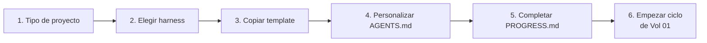

# Vol 07 · Acoplamiento con Harness

> Anterior: [Vol 06 · Gap tracking](./vol-06-gap-tracking.md) · Siguiente: [Vol 08 · MCPs y autonomía](./vol-08-mcps-y-autonomia.md)

## Cómo Definir el Tipo de Proyecto

Antes de crear cualquier archivo, responder estas preguntas. Un proyecto
que hoy parece pequeño puede volverse monumental — la estructura inicial
debe soportar ambas escalas.

**1. ¿Cuál es el objetivo principal?** Una frase que describe qué resuelve
y para quién.

**2. ¿Qué stack?** Lenguaje + versión, framework, herramienta de test,
build/packaging.

**3. ¿Solo o en equipo?** Solo → más flexibilidad. Equipo → SDD estricto,
fuente de verdad en repo.

**4. ¿Cuál es la escala esperada?**

| Escala | Descripción | Estructura inicial |
|---|---|---|
| Chico | Script, herramienta simple | AGENTS.md + README + src + tests |
| Mediano | Servicio con 2-4 capacidades | + specs/ + PROGRESS.md + docs/ |
| Grande | Sistema con múltiples módulos | + .github/ completo + progress/ |
| No sé | Empezar con mediano | Igual que mediano |

**5. ¿Hay reglas de dominio configurables?** YAML rules, políticas
declarativas → agregar `config/rules/` + leer Vol 04 · YAML domain.

**6. ¿Hay integraciones externas?** APIs, bases de datos, servicios
externos. Identificarlas al inicio.

**7. ¿Qué CI/herramienta principal?** GitHub Actions → GitHub-first. Claude
diario → Claude-first. Sin preferencia → Portable.

**Output de esta sesión antes de escribir código:**

1. `AGENTS.md` inicial con stack, comandos y reglas.
2. `README.md` con descripción y estructura.
3. `PROGRESS.md` con primera fase o slices.
4. Lista de gaps iniciales (de la biblioteca [Vol 06](./vol-06-gap-tracking.md)).
5. Estructura de carpetas inicial.

---

## La Biblia y el Harness

**Esta biblia aporta:** el modelo mental, el proceso, las convenciones por
stack, la biblioteca de gaps, los formatos.

**El harness template aporta:** la estructura de carpetas lista para copiar,
AGENTS.md base pre-cargado, templates de specs, prompts pre-cargados,
scripts de setup.

El template implementa la biblia. Si hay conflicto, la biblia gana.

El repositorio operativo del harness vive separado:
[Hebri-AI-Harness](https://github.com/HebrineX/Hebri-AI-Harness).

La separación importa:

| Repo | Responsabilidad | Cambia cuando |
|---|---|---|
| `Hebri-AI-Structure` | Criterio, metodología, patrones | Cambia el modo de pensar o decidir |
| `Hebri-AI-Harness` | Archivos, prompts, registry, locks, scripts | Cambia la operación concreta |

No copiar el harness dentro de la biblia ni copiar la biblia dentro del
harness. Se enlazan y evolucionan juntos, pero versionados por separado.

Un harness preparado para producción no es solo una carpeta de prompts.
Debe traer contratos operativos mínimos:

- modos de operación (`manual` y `automático`);
- límite de concurrencia y registry de agentes;
- locks de ownership antes de escribir;
- gates binarios por ciclo o slice;
- handoffs por archivo;
- políticas de permisos, riesgo y recuperación;
- guía de AI Engineering para prompts, modelos, tools, retries, validación,
  cache y observabilidad.

**Flujo de arranque:**



En el AGENTS.md del proyecto, agregar referencia:

```markdown
## Metodología
Este proyecto sigue Hebri-AI-Structure: [link al repo]
```

No copiar el contenido de la biblia al proyecto — referenciarla.

---

## Harness mínimo recomendado

```text
.hebrinex/
  AGENTS.md
  PROGRESS.md
  prompts/
  agents/
  orquestador/
    context/
    method/
      operating-modes.md
      multiagent-protocol.md
      ai-engineering.md
    policies/
    sdd/
      specs/
      progress/
        registry.md
        blocked.md
        locks/
        cycles/
```

La ruta exacta puede variar por herramienta (`.github/orquestador/`,
`.claude/`, `.hebrinex/`), pero la responsabilidad no: una sola fuente de
verdad para specs, progreso, permisos y handoffs.

---

## Protocolo de evolución Biblia ↔ Harness

Cuando una sesión real revela una fricción:

1. Registrar el gap donde apareció: normalmente en el harness o en el
   `PROGRESS.md` del proyecto.
2. Decidir si el problema es operativo o metodológico.
3. Si es operativo, cambiar `Hebri-AI-Harness`.
4. Si es conceptual, cambiar `Hebri-AI-Structure`.
5. Si afecta a ambos, cambiar primero la biblia y después reflejarlo en el
   harness.
6. Cerrar el gap con referencia al commit, PR o versión que lo resolvió.

**Regla:** el harness no inventa metodología nueva en silencio. Si una regla
operativa nueva demuestra ser general, vuelve a la biblia.

---

## Gaps activos de este volumen

### Gap H-01 — Harness template publicado, pendiente de validación

**Estado:** Publicado · En validación · **Capa:** Docs

**Descripción:** El presente volumen describe cómo acoplar un harness al
flujo de Hebri-AI-Structure. Ya existe una materialización publicada como
repo independiente, pendiente de validación con proyectos reales.

**Contexto:** El template implementa la biblia. Sin él, cada proyecto nuevo
tiene que reconstruir manualmente la estructura inicial — lo cual
contradice el principio de no repetir el mismo razonamiento.

**Motivo de diferimiento:** El primer hito fue dejar la metodología
documentada y estable. El harness ahora entra en etapa de validación como
proyecto propio, con SDD y fases.

**Destino:** [Hebri-AI-Harness](https://github.com/HebrineX/Hebri-AI-Harness).
Cuando pase validación piloto, se marcará como resuelto.

**Resuelto por:** Publicación inicial de `Hebri-AI-Harness` (pendiente de
validación en proyecto piloto).
