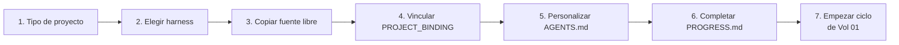

# Vol 07 · Acoplamiento con Harness

> Anterior: [Vol 06 · Gap tracking](./vol-06-gap-tracking.md) · Siguiente: [Vol 08 · MCPs y autonomía](./vol-08-mcps-y-autonomia.md)

## Cómo Definir el Tipo de Proyecto

Antes de crear cualquier archivo, responder estas preguntas. Un proyecto
que hoy parece pequeño puede volverse monumental — la estructura inicial
debe soportar ambas escalas.

**1. ¿Cuál es el objetivo principal?** Una frase que describe qué resuelve
y para quién.

**2. ¿Qué stack?** Lenguaje + versión, framework, herramienta de test,
build/packaging.

**3. ¿Solo o en equipo?** Solo → más flexibilidad. Equipo → SDD estricto,
fuente de verdad en repo.

**4. ¿Cuál es la escala esperada?**

| Escala | Descripción | Estructura inicial |
|---|---|---|
| Chico | Script, herramienta simple | AGENTS.md + README + src + tests |
| Mediano | Servicio con 2-4 capacidades | + specs/ + PROGRESS.md + docs/ |
| Grande | Sistema con múltiples módulos | + .github/ completo + progress/ |
| No sé | Empezar con mediano | Igual que mediano |

**5. ¿Hay reglas de dominio configurables?** YAML rules, políticas
declarativas → agregar `config/rules/` + leer Vol 04 · YAML domain.

**6. ¿Hay integraciones externas?** APIs, bases de datos, servicios
externos. Identificarlas al inicio.

**7. ¿Qué CI/herramienta principal?** GitHub Actions → GitHub-first. Claude
diario → Claude-first. Sin preferencia → Portable.

**Output de esta sesión antes de escribir código:**

1. `AGENTS.md` inicial con stack, comandos y reglas.
2. `README.md` con descripción y estructura.
3. `PROGRESS.md` con primera fase o slices.
4. Lista de gaps iniciales (de la biblioteca [Vol 06](./vol-06-gap-tracking.md)).
5. Estructura de carpetas inicial.

---

## La Biblia y el Harness

**Esta biblia aporta:** el modelo mental, el proceso, las convenciones por
stack, la biblioteca de gaps, los formatos.

**El harness operativo aporta:** la estructura de carpetas lista para copiar,
AGENTS.md base pre-cargado, templates de specs, prompts pre-cargados,
scripts de setup, estado estructurado y controles de aprobación.

El harness implementa la biblia. Si hay conflicto, se registra el gap y se
decide si corresponde corregir la biblia, el harness o ambos.

El repositorio operativo del harness vive separado:
[Hebri-AI-Harness](https://github.com/HebrineX/Hebri-AI-Harness).

La separación importa:

| Repo | Responsabilidad | Cambia cuando |
|---|---|---|
| `Hebri-AI-Structure` | Criterio, metodología, patrones | Cambia el modo de pensar o decidir |
| `Hebri-AI-Harness` | Archivos, prompts, registry, locks, scripts | Cambia la operación concreta |

No copiar el harness dentro de la biblia ni copiar la biblia dentro del
harness. Se enlazan y evolucionan juntos, pero versionados por separado.

Un harness preparado para producción no es solo una carpeta de prompts.
Debe traer contratos operativos mínimos:

- binding de proyecto para distinguir fuente libre de harness vinculado;
- modos de operación (`manual` y `automático`);
- contrato de sesión obligatorio;
- resolución estricta de `.hebrinex` por proyecto;
- re-entry obligatorio después de compactación o cambio de proyecto;
- independencia técnica y anti-confirmation bias;
- límite de concurrencia y registry de agentes;
- roles mínimos con perfiles parametrizados;
- locks de ownership antes de escribir;
- gates binarios por ciclo o slice;
- clarification gate, analysis checklist y blast radius;
- task graph para slices, dependencias y waves;
- preflight y approval envelope antes de efectos;
- state y registry estructurados;
- audit trail y evidencia verificable;
- auditor, reporter y detractor pass para decisiones importantes;
- cierre explícito de agentes;
- handoffs por archivo;
- políticas de permisos, riesgo y recuperación;
- guía de AI Engineering para prompts, modelos, tools, retries, validación,
  cache y observabilidad.
- manifest estructural para que la validación no dependa de listas duplicadas
  en scripts.
- presupuestos explícitos de contexto para que el ahorro de tokens sea
  verificable y no aspiracional;
- validador local con pruebas negativas para detectar drift antes de migrar o
  cerrar versión;
- memoria estratificada local, diaria, de ciclo, de proyecto y completa;
- entrypoints de primer mensaje, re-entry liviano/completo, debug-log intake y recuperación post-compactación;
- adapters por IA para Codex, Claude Code, Gemini, Qwen, DeepSeek, Cursor, Copilot y herramientas genéricas.
- exclusión material de documentación personal (`infoHebri.md`) del harness
  operativo y de las copias `bound`.

**Flujo de arranque:**



En el AGENTS.md del proyecto, agregar referencia:

```markdown
## Metodología
Este proyecto sigue Hebri-AI-Structure: [link al repo]
```

No copiar el contenido de la biblia al proyecto — referenciarla.

---

## Binding de proyecto y anti-contaminación

Desde `Hebri-AI-Harness 0.8.7`, el harness ya no se trata como una carpeta
genérica reutilizable en vivo. Cada proyecto debe operar con su propio
`.hebrinex/` interno.

Estados conceptuales:

| Estado | Uso permitido | Uso prohibido |
|---|---|---|
| `source_template` | Fuente libre para copiar, auditar o editar el repo del harness | Operar un proyecto consumidor desde esa carpeta |
| `bound` | Operar el proyecto cuyo `project_root` coincide | Operar otro proyecto o recibir estado ajeno |

Reglas:

- Si el proyecto tiene `.hebrinex/`, se valida su binding antes de operar.
- Si no tiene `.hebrinex/`, se busca una fuente local libre y se copia al
  proyecto.
- Si no existe fuente local libre, se baja el repo del harness y se vincula.
- Un harness externo nunca es autoridad operativa del proyecto activo.
- La copia hacia un proyecto excluye `infoHebri.md`, `.git/` y temporales.
- `scripts/validate-harness.ps1 -RunNegativeTests` debe pasar antes de dar por
  sana una migración.
- Specs, registry, locks, gates y reportes viven solo en el `.hebrinex/`
  vinculado al proyecto.

Esto evita que una sesión compactada o un cambio de carpeta escriba estado de
un proyecto dentro del harness de otro.

---

## Memoria estratificada gobernada por orquestador

Desde `Hebri-AI-Harness 0.8.7`, el problema de foco no se resuelve confiando
en la memoria interna de cada IA. Se resuelve con memoria externa en archivos,
marcada por el orquestador.

| Capa | Uso | Carga por defecto |
|---|---|---:|
| `local` | contrato activo, session pin, foco actual | sí |
| `daily` | decisiones y errores del día | sí, si aplica |
| `cycle` | fase/slice, roles, locks, approvals y gates | si hay ciclo activo |
| `project` | hechos estables, arquitectura y decisiones vigentes | por perfil |
| `complete` | auditoría global, migración o reconstrucción histórica | no |

Regla: el modelo no decide libremente qué recordar. Lee
`memory-registry.yaml`, aplica `memory-routing.yaml` y carga sólo las capas
habilitadas por el orquestador.

La memoria completa requiere motivo, alcance y aprobación cuando implica
lectura amplia o un cierre derivado de historia.

El presupuesto de contexto vive en `orquestador/context-budget.yaml`. Si un
entrypoint supera su presupuesto (`memory_bootstrap`, `first_message`,
`debug_log_intake`, `leader_light`, etc.), el agente debe detenerse, declarar
el exceso y pedir un brief más acotado o aprobación explícita para contexto
completo.

---

## Harness mínimo recomendado

```text
.hebrinex/
  PROJECT_BINDING.yaml
  AGENTS.md
  PROGRESS.md
  init.sh
  scripts/
    validate-harness.ps1
  prompts/
  agents/
  orquestador/
    harness-manifest.txt
    context-budget.yaml
    context-profiles.md
    context/
    memory/
      memory-registry.yaml
      memory-routing.yaml
      local/session-pin.md
      daily/
      cycle/
      project/
      complete/
    entrypoints/
      first-message.md
      reentry-light.md
      reentry-full.md
      debug-log-intake.md
      compactation-recovery.md
    adapters/
      generic-ai.md
      codex.md
      claude-code.md
      gemini.md
      qwen.md
      deepseek.md
    method/
      session-contract.md
      harness-resolution.md
      evidence-reconstruction.md
      changelog-policy.md
      deploy-migration-policy.md
      reference-drift-policy.md
      ci-pipeline-policy.md
      backlog-policy.md
      audit-reporting-policy.md
      final-report-evidence-policy.md
      ai-preset-policy.md
      memory-layer-policy.md
      adapter-contract.md
      context-loading-policy.md
      operating-modes.md
      multiagent-protocol.md
      agent-role-taxonomy.md
      ai-engineering.md
    policies/
      tool-policy.yaml
      command-taxonomy.md
      write-set-policy.md
      secret-denylist.md
      schemas/
        project-binding.schema.yaml
        context-budget.schema.yaml
        memory-registry.schema.yaml
        registry.schema.yaml
    sdd/
      specs/
      progress/
        state.yaml
        registry.yaml
        registry.md
        blocked.md
        approvals/
        locks/
        cycles/
          _template/
            audit.jsonl
            gate-log.yaml
        templates/
          approval-envelope.md
          preflight-template.md
          reentry-checklist.md
          clarification-checklist.md
          analysis-checklist.md
          blast-radius.md
          task-graph.yaml
          agent-profile-template.yaml
          detractor-pass.md
          changelog-reconstruction-checklist.md
          release-history-matrix.yaml
          deploy-migration-checklist.md
          reference-drift-matrix.yaml
          ci-pipeline-history.yaml
          backlog-classification-matrix.yaml
          audit-report-contract.md
          final-report-crosslink-checklist.md
          ai-preset-contract.md
          memory-closure-checklist.md
          verification-matrix.yaml
          final-report.md
          agent-closure.md
```

En la implementación vigente del harness, el orquestador operativo vive en
`.hebrinex/orquestador/`. Las carpetas de herramienta como `.github/` o
`.claude/` pueden contener prompts o adaptadores, pero no reemplazan esa fuente
de verdad para specs, progreso, permisos y handoffs.

---

## Protocolo de evolución Biblia ↔ Harness

Cuando una sesión real revela una fricción:

1. Registrar el gap donde apareció: normalmente en el harness o en el
   `PROGRESS.md` del proyecto.
2. Decidir si el problema es operativo o metodológico.
3. Si es operativo, cambiar `Hebri-AI-Harness`.
4. Si es conceptual, cambiar `Hebri-AI-Structure`.
5. Si afecta a ambos, cambiar primero la biblia y después reflejarlo en el
   harness.
6. Cerrar el gap con referencia al commit, PR o versión que lo resolvió.

**Regla:** el harness no inventa metodología nueva en silencio. Si una regla
operativa nueva demuestra ser general, vuelve a la biblia.

---

## Gaps activos de este volumen

### Gap H-01 — Harness operativo publicado, pendiente de validación piloto

**Estado:** Publicado · En validación piloto · **Capa:** Docs

**Descripción:** El presente volumen describe cómo acoplar un harness al
flujo de Hebri-AI-Structure. Ya existe una materialización publicada como
repo independiente. La referencia operativa actual es
`Hebri-AI-Harness 0.8.7`, que agrega binding de proyecto, resolución estricta
del harness, re-entry post-compactación, contrato de sesión, controles P0
estructurados, state/registry YAML, preflight, approval envelope, policies
deny-by-default, audit trail, gate logs, cierre explícito de agentes,
anti-confirmation bias, roles mínimos con perfiles parametrizados, auditor,
reporter, detractor pass, clarification gate, analysis checklist, blast radius,
task graph, gates de evidencia histórica, deploy/migración, drift de
referencias, CI/pipeline, backlog, cierre con cross-links, adapters multi-IA,
entrypoints de re-entry, memoria estratificada gobernada por orquestador,
manifest estructural, presupuestos de contexto y validador local.

**Contexto:** El template implementa la biblia. Sin él, cada proyecto nuevo
tiene que reconstruir manualmente la estructura inicial — lo cual
contradice el principio de no repetir el mismo razonamiento.

**Motivo de diferimiento:** El harness ya existe y evolucionó hasta 0.8.7.
El trabajo pendiente es validarlo en proyectos reales y retroalimentar la
biblia con fricciones repetidas.

**Destino:** [Hebri-AI-Harness](https://github.com/HebrineX/Hebri-AI-Harness).
Cuando pase validación piloto, se marcará como resuelto.

**Resuelto por:** Publicación y hardening P0 de `Hebri-AI-Harness`
0.8.7 (pendiente de validación continua en proyecto piloto
`Hebri-AI-Portfolio`).

---

## Harness 0.8.7 - Runtime, Portabilidad y Drift

La referencia operativa actual es `Hebri-AI-Harness 0.8.7`. La línea 0.8.3-0.8.7 agrega controles que la biblia trata como criterio metodológico:

- 0.8.3: `detractor-senior` antes de implementar cambios relevantes.
- 0.8.4: core portable + adapters declarativos por IA.
- 0.8.5: runtime liviano `/harness` y `active-session` como cache no autoritativa.
- 0.8.6: Claude reentry persistente mediante brief y hooks recomendados.
- 0.8.7: instruction builder y drift validator fuerte.

Regla conceptual: el harness puede generar o resumir contexto, pero la autoridad sigue en binding, state, registry, gates, evidencia y locks.
