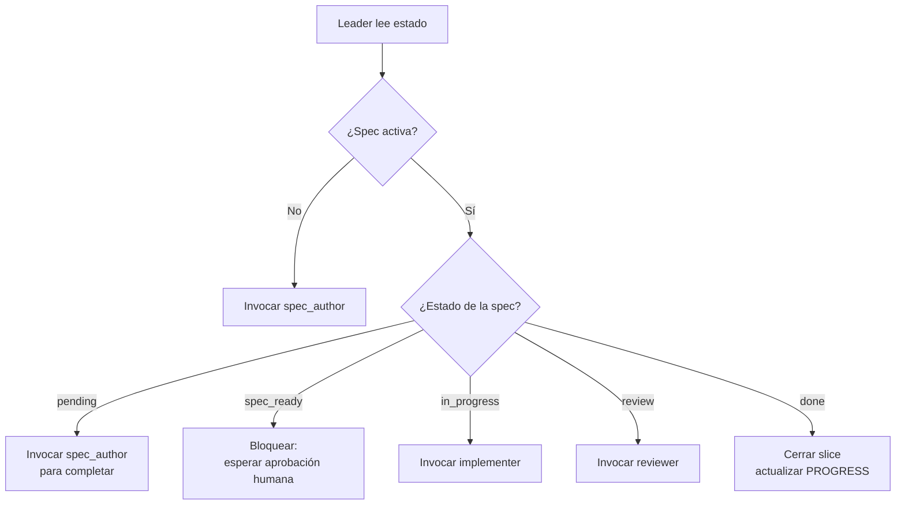

# Vol 09 · Roles Cerrados de Harness

> Anterior: [Vol 08 · MCPs y autonomía](./vol-08-mcps-y-autonomia.md) · Siguiente: [Apéndice](./apendice-ejemplo-end-to-end.md)

[Vol 02](./vol-02-subagentes.md) define la separación informal Explorer/Worker.
Eso alcanza para tareas chicas. Cuando hay harness con SDD y proceso de
aprobación, hace falta una división más estricta: **el rol que produce no
debe ser el mismo que aprueba**.

Este volumen define los roles cerrados que sostienen ese principio y la
evolución de `3.0.0`: roles mínimos con perfiles parametrizados.

---

## Protocolo Multiagente

En `Hebri-AI-Harness 0.8.8`, el chat visible actúa como **intérprete** por
defecto. Comunica estado, pedidos de aprobación y resultados. El leader es el
coordinador operativo y debe quedar visible en conversación, registry o
artefacto. Si el leader no está visible, no se despachan workers ni se cierran
fases.

Antes de coordinar, el leader valida el binding del harness:

```text
- project_root confirmado;
- harness_path confirmado;
- PROJECT_BINDING.yaml válido;
- binding `bound` si es proyecto consumidor;
- `source_template` solo si se está editando el repo fuente del harness.
```

El límite operativo recomendado es **5 agentes activos en total**:

| Slot | Rol | Uso |
|---|---|---|
| 0 | leader | Orquesta, registra, decide y bloquea |
| 1-4 | subagentes | executor, reviewer, auditor, reporter, explorer, spec_author, implementer o worker |

Un pedido de 30 agentes no significa 30 ejecuciones simultáneas. Significa
30 asignaciones lógicas ciclando en tandas: un leader y hasta cuatro
subagentes por ciclo. Cada ciclo deja registry, locks, gates, evidencia y
handoff.

Artefactos mínimos:

```text
progress/
  PROJECT_BINDING.yaml
  state.yaml
  registry.yaml
  registry.md
  blocked.md
  approvals/
  locks/
  cycles/
    C-001/
      audit.jsonl
      gate-log.yaml
      <slice>/
        brief.md
        impl_<agent-id>.md
        review_<agent-id>.md
        verification-matrix.yaml
        final-report.md
        agent-closure.md
        handoff.md
```

Gates recomendados:

| Gate | Criterio |
|---|---|
| G0_session_contract | Contrato de sesión declarado, modo definido, chat intérprete y leader visible |
| G0A_memory_registry_loaded | Session pin, memory registry y routing cargados según entrypoint |
| G1_context_ready | Objetivo, modo, scope, aclaraciones, supuestos y riesgos claros |
| G2_dispatch_ready | Roles, slots y ownership registrados |
| G3_locks_acquired | Escrituras con lock válido |
| G4_execution_complete | Artefactos y evidencia entregados |
| G5_review_or_validation | Reviewer o leader valida contra contrato |
| G6_agent_closure_complete | Todos los agentes tienen cierre, handoff y locks resueltos |
| G7_handoff_complete | Registry, gaps y próximo paso actualizados |

Subgates P0 y condicionales de `0.8.8`:

| Subgate | Criterio |
|---|---|
| G1A_clarification_complete | Preguntas bloqueantes resueltas o supuestos aceptados |
| G1B_analysis_complete | Requisitos, constraints, riesgos y evidencia esperada revisados |
| G1C_blast_radius_declared | Read-set, write-set, comandos, red, git, rollback y riesgos declarados |
| G2A_task_graph_ready | Dependencias, waves y paralelismo definidos |
| G5A_detractor_pass_complete | Decisiones importantes revisadas por `auditor(profile: detractor)` |
| G5B_release_reconstruction_complete | Changelog, release notes o docs históricas revisadas contra matriz de evidencia |
| G5C_deploy_migration_complete | Deploy/migración con entorno, comando, evidencia y rollback cuando aplica |
| G5D_reference_drift_complete | Versión y referencias operativas sin drift |
| G5E_ci_pipeline_history_complete | Iteraciones de CI/pipeline mapeadas si fueron parte del cambio |
| G5F_backlog_classification_complete | P0/P1/P2 justificados por impacto, bloqueo y dependencia |
| G5G_audit_report_contract_complete | Auditor y reporter separados sin cambiar veredicto |
| G5H_final_report_crosslink_complete | Final report conectado con gates, evidencia, closures, locks y gaps |
| G5I_memory_consistency_complete | Memoria activa consistente con state, registry, approvals y gates |
Cada gate produce `pass`, `fail` o `blocked`.

**Regla P0:** un ciclo no puede cerrarse si quedan agentes abiertos, locks
sin resolver, approval pendiente o evidencia ausente. Los ciclos históricos
sin estos artefactos se marcan como `legacy_unverified`; no se inventa
evidencia retroactiva.

---

## Roles Mínimos y Perfiles

La versión `3.0.0` de la biblia cambia el eje: no se agregan roles por cada
especialidad. Se mantienen pocos roles mínimos y se parametrizan perfiles.

```text
Rol estructural = responsabilidad estable.
Perfil = especialización temporal.
Tarea = objetivo concreto de ese ciclo.
```

| Rol mínimo | Responsabilidad | No puede |
|---|---|---|
| `interpreter` | Comunica con el operador, traduce estado y pide `SI` | Coordinar de forma invisible |
| `leader` | Orquesta, registra, decide y bloquea o libera ciclos | Implementar |
| `executor` | Produce cambios dentro de scope aprobado | Aprobar su propio trabajo |
| `reviewer` | Revisa producción contra spec, diff y evidencia | Editar código |
| `auditor` | Audita contrato, proceso, riesgos, sesgos y cumplimiento | Implementar o aprobar |
| `reporter` | Comunica resultados de forma clara, humana y accionable | Cambiar veredicto o inventar evidencia |

Responsabilidades nuevas de `0.8.8`:

- `leader`: valida binding, project root y harness path antes de despachar.
- `leader`: valida `context-budget.yaml` y bloquea rutas que exceden
  presupuesto sin aprobación.
- `leader`: decide qué capas de memoria están activas y no permite memoria completa sin motivo.
- `auditor(profile: harness_compliance)`: verifica que no haya contaminación
  entre proyectos, que no se use un harness externo como autoridad y que haya
  re-entry post-compactación.
- `auditor(profile: harness_compliance)`: compara memoria local/diaria/ciclo contra state, registry, approvals y gates.
- `auditor(profile: cost)`: verifica que los entrypoints respeten presupuesto
  y que no se cargue `infoHebri.md` ni memoria completa por defecto.
- `auditor(profile: release)`: valida changelog, release notes y documentación
  histórica contra evidencia.
- `auditor(profile: pipeline)`: audita CI, deploy, migraciones, drift de
  referencias y cierre de versión.
- `reporter`: comunica `missing`, `mismatch`, approvals expirados y bloqueos
  sin suavizar el veredicto.

Perfiles:

```yaml
role: auditor
profile: harness_compliance | cost | security | architecture | release | pipeline | detractor
```

```yaml
role: reporter
profile: operator | technical | executive
```

**Regla anti-explosión:** no se crea un rol nuevo si la necesidad puede
expresarse como perfil de un rol existente.

**Regla anti-confirmation bias:** ni el pedido humano ni la conclusión de un
agente son verdad por autoridad. Se validan por evidencia, contrato, contexto
y riesgo.

---

## Roles Históricos Cerrados

| Rol | Puede | NO puede |
|---|---|---|
| **leader** | Orquestar, leer estado, lanzar agentes, cambiar estados | Implementar código |
| **spec_author** | Escribir `requirements.md`, `design.md`, `tasks.md` | Tocar `src/` o `tests/` |
| **implementer** | Ejecutar tasks aprobadas, tocar código y tests | Autoaprobarse, tocar fuera de ownership |
| **reviewer** | Revisar specs, tests, trazabilidad y checkpoints | Editar código |

Entre `spec_author` e `implementer` existe una **puerta de aprobación
humana**. Un spec puede estar muy bien escrito y resolver el problema
equivocado. El implementer no arranca hasta que una persona acepta alcance,
no objetivos y criterios de aceptación.

En harness `0.8.8`, `spec_author` e `implementer` pueden verse como perfiles
operativos de `executor` cuando la herramienta necesita menos roles visibles.
La separación produce/aprueba se mantiene igual.

---

## El Leader

El leader es el rol que **pivotea** — el que decide qué hacer ahora dado el
estado actual. Su valor está en mantener el proceso: una feature activa,
spec aprobada, ownership claro, subagentes correctos y verificación final.

**Antipatrón:** el leader que se convierte en implementer cuando aparece
una dificultad. Si eso pasa, deja de mantener el hilo y nadie lo retoma.

### Qué lee el leader

1. `PROGRESS.md` — fase y slice activos, gaps abiertos.
2. `specs/<feature-activa>/` — estado de aprobación.
3. `AGENTS.md` — reglas operativas del repo.
4. `progress/registry.md`, locks y blocked queue si existe protocolo
   multiagente.
5. `memory/local/session-pin.md`, `memory/memory-registry.yaml`,
   `memory/memory-routing.yaml` y `context-budget.yaml` para saber qué
   contexto cargar.
6. Último output de cualquier subagente que esté en handoff.

### Qué produce el leader

Una decisión, no un cambio:

```text
Estado leído: Slice 2.1, spec_ready, sin aprobación humana.
Próximo paso: bloquear hasta que humano apruebe specs/2.1-scheduler/.
Siguiente rol activo: humano (revisor de la spec).
Después: implementer con ownership src/Worker/Scheduling/.
```

### Mapa de pivoteo



---

## Spec Author

Convierte intención en contrato. Su salida no es una opinión por chat,
sino archivos:

```text
specs/<feature>/requirements.md   ← EARS (ver Vol 03)
specs/<feature>/design.md         ← archivos afectados, decisiones, alternativas descartadas
specs/<feature>/tasks.md          ← lista trazable a requirements
```

**Restricción crítica:** no toca `src/` ni `tests/`. Si la spec requiere
saber detalles del código, lo pide al explorer ([Vol 02](./vol-02-subagentes.md))
o al leader, que lo enruta.

---

## Implementer

Trabaja **solo después de aprobación**. Si la spec está `pending` o
`spec_ready` sin aprobar, no implementa.

Salida obligatoria:

```text
Resultado: implementado
Artefacto: progress/impl_<feature>.md
Archivos tocados: [lista exacta]
Evidencia: [comando ejecutado + resultado, ej. "47 passed"]
Bloqueos: [ninguno | descripción]
```

Si necesita tocar fuera de su ownership, **escala al leader**, no improvisa.
Si el harness usa locks, no empieza escritura sin lock válido.
Si el harness usa controles P0, también requiere preflight, approval envelope
y write-set declarado antes de mutar archivos.

---

## Reviewer

Revisa. No arregla. Si toca código, deja de ser reviewer y se rompe la
separación de responsabilidades.

Salida obligatoria:

```text
progress/review_<feature>.md
```

Decisión binaria + razonada: aprobado / bloqueado. Si bloquea, lista los
hallazgos con archivo:línea y qué requirement queda descubierto.
Si hay registry/gate-log, también verifica que la evidencia esté completa.
Si hay controles P0, verifica `state.yaml`, `registry.yaml`, `gate-log.yaml`,
`verification-matrix.yaml`, `final-report.md` y `agent-closure.md`.

Causales típicas de rechazo:

- Requirement sin test.
- Task sin requirement asociado.
- Spec aprobada cambió después de la aprobación.
- Tests pasan pero modificaron la lógica del test, no la de producción.
- Decisiones de diseño tomadas que no figuran en `design.md`.

---

## Auditor

Auditor revisa el proceso, no produce cambios. Puede auditar cumplimiento del
harness, costo, seguridad, arquitectura, release o contradicciones internas.

Salida obligatoria:

```text
Veredicto:
Evidencia observada:
Incumplimientos:
Riesgos:
Supuestos débiles:
Plan P0/P1/P2:
Bloqueos:
```

El perfil `detractor` cuestiona una tesis concreta:

```text
Tesis evaluada:
Objeciones:
Evidencia:
Severidad:
Qué falsaría la objeción:
Recomendación:
```

Auditor no reemplaza reviewer. Reviewer mira si una implementación cumple una
spec. Auditor mira si el sistema, la evidencia y el proceso sostienen el
veredicto.

---

## Reporter

Reporter convierte salidas técnicas en reportes claros para el operador. Su
función es reducir ruido sin ocultar riesgos.

Puede:

- ordenar hallazgos por impacto;
- separar hechos, inferencias y recomendaciones;
- traducir auditorías densas en decisiones accionables;
- preparar reporte técnico, ejecutivo u operativo.

No puede:

- inventar evidencia;
- aprobar cambios;
- cambiar el veredicto del auditor sin justificarlo;
- cerrar ciclos;
- suavizar riesgos hasta volverlos invisibles.

Salida mínima:

```text
Resumen humano:
Veredicto:
Hallazgos principales:
Impacto:
Decisiones requeridas:
Riesgos abiertos:
Qué requiere SI:
```

---

## Contrato de Handoff

Cada rol tiene entrada permitida, salida esperada y criterio de escalada.

| Rol | Entrada permitida | Salida esperada | Cuándo escalar |
|---|---|---|---|
| **explorer** | Pregunta acotada, rutas, criterio de búsqueda | Hallazgos con evidencia y dudas abiertas | Falta información o aparecen contradicciones |
| **spec_author** | Issue, contexto, no objetivos | Requirements, design y tasks trazables | El alcance no puede cerrarse sin decisión humana |
| **implementer** | Spec aprobada, ownership y tests esperados | Cambio acotado, archivos tocados y evidencia | Necesita tocar fuera de ownership |
| **reviewer** | Diff, spec, tests y trace | Hallazgos, bloqueo o aprobación razonada | El resultado contradice el contrato |
| **auditor** | Estado, registry, gates, evidencia, outputs de roles | Veredicto, incumplimientos, riesgos y plan | Falta evidencia o hay contradicción |
| **reporter** | Hallazgos, evidencia y audiencia objetivo | Informe claro y decisiones accionables | El reporte necesita alterar veredicto |

**Regla:** si un subagente devuelve algo parcial, no se lo resume para
seguir igual. Se hace una de tres cosas — pedir aclaración, reintentar con
recorte más chico, o escalar a decisión humana. Esa regla evita integrar
trabajo ambiguo por inercia.

---

## Anti Teléfono Descompuesto

Problema común: cada agente devuelve un resumen largo por chat, el siguiente
agente lee ese resumen, otro resume el resumen. Después de 3 saltos, nadie
está leyendo el artefacto original.

**Regla operativa:** los subagentes escriben resultados en archivos y
devuelven solo una referencia.

Ejemplo correcto:

```text
spec_author:
  escribe specs/cli_recent/requirements.md
  escribe specs/cli_recent/design.md
  escribe specs/cli_recent/tasks.md
  responde: "Spec lista en specs/cli_recent/"

implementer:
  escribe progress/impl_cli_recent.md
  responde: "Implementación registrada en progress/impl_cli_recent.md"

reviewer:
  escribe progress/review_cli_recent.md
  responde: "Revisión aprobada en progress/review_cli_recent.md"
```

**El chat coordina. Los archivos conservan la verdad.**

Ejemplo de lo que hay que evitar:

> "El subagente dijo que estaba todo bien y que había agregado tests."

Eso no alcanza. No dice qué archivos cambió, qué requirement cubrió, qué
comando corrió ni qué evidencia dejó.

---

## Roles Cerrados vs Explorer/Worker

| Aspecto | Par informal (Vol 02) | Roles mínimos/perfiles (este vol) |
|---|---|---|
| Cuándo usar | Tareas chicas, sin proceso de aprobación | Harness con SDD activo o decisiones con evidencia |
| Separación produce/aprueba | No estricta | Estricta |
| Salida obligatoria por archivo | Sugerida | Obligatoria |
| Puerta humana entre roles | Opcional | Entre producción, revisión, auditoría y efectos |
| Trazabilidad | Recomendada | Requerida |

Empezás con explorer/worker. Cuando el proyecto crece (más de una feature
viva, equipo, reviewers externos o necesidad de auditoría), migrás a roles
mínimos con perfiles parametrizados.

---

## Materialización por Herramienta

### Claude Code

```text
.claude/agents/
  leader.md
  spec_author.md
  implementer.md
  reviewer.md
  auditor.md
  reporter.md
```

Cada archivo define el rol como subagente con su ownership y prompt base.

### GitHub Copilot

Los roles viven como prompts invocables en `.github/prompts/`:

- `/lider` — invoca el leader sobre el estado actual.
- `/spec-author` — invoca el spec_author.
- `/implementer` — invoca el implementer.
- `/reviewer` — invoca el reviewer.
- `/auditor` — invoca auditoría de cumplimiento, riesgo o detractor pass.
- `/reporter` — transforma hallazgos en reporte para el operador.

Ver los prompts en este repo bajo `.github/prompts/`.

### Sin agentes explícitos

Una sola persona alterna roles manualmente, pero respetando la separación:
**al cambiar de rol, cambia el archivo de salida**. No hay rol implícito.

---

## Anti-patrones de Roles

1. **Leader que implementa.** Pierde el hilo de proceso. Si pasa, parar y
   re-asignar al implementer.

2. **Spec author tocando código.** "Solo un ajuste chiquito". Rompe la
   puerta de aprobación humana.

3. **Implementer auto-aprobándose.** Cierra tareas sin reviewer. Detecta:
   `progress/review_*.md` no existe.

4. **Reviewer que arregla.** Convierte el rechazo en commit propio. Detecta:
   diff del reviewer toca archivos de prod.

5. **Saltarse al spec_author** "porque la tarea es chica". Si la tarea es
   chica de verdad, usar explorer/worker informal de [Vol 02](./vol-02-subagentes.md).
   Si necesita estar en `specs/`, necesita spec_author.

6. **Roles cerrados sin handoff por archivo.** Vuelve el teléfono
   descompuesto. Forzar que cada rol cierre con archivo + referencia.

7. **Multiplicar roles por especialidad.** `security_auditor`,
   `cost_auditor`, `architecture_auditor` como roles permanentes genera ruido.
   Usar `auditor(profile: security|cost|architecture)`.

8. **Reporter que maquilla riesgos.** Un reporte más humano no significa
   menos preciso. Si oculta evidencia o baja severidad sin motivo, rompe el
   contrato.

9. **Detractor infinito.** El detractor no existe para debatir todo. Se activa
   en cierres o decisiones relevantes y debe objetar con evidencia o hipótesis
   verificable.

---

## Detractor Senior y Reporter en 0.8.8

`detractor-senior` es un perfil previo a implementación. Su salida puede bloquear, simplificar o pedir evidencia. No implementa y no aprueba.

`reporter` traduce evidencia a reporte legible sin maquillar severidad. Auditor decide veredicto; reporter comunica.

La estructura mantiene mínimos roles activos: 1 leader + hasta 4 subagentes. Más perfiles no significan más agentes activos.
