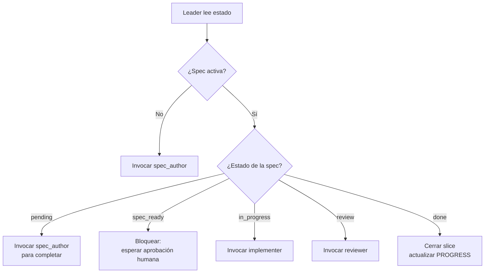

# Vol 09 · Roles Cerrados de Harness

> Anterior: [Vol 08 · MCPs y autonomía](./vol-08-mcps-y-autonomia.md) · Siguiente: [Apéndice](./apendice-ejemplo-end-to-end.md)

[Vol 02](./vol-02-subagentes.md) define la separación informal Explorer/Worker.
Eso alcanza para tareas chicas. Cuando hay harness con SDD y proceso de
aprobación, hace falta una división más estricta: **el rol que produce no
debe ser el mismo que aprueba**.

Este volumen define los cuatro roles cerrados que sostienen ese principio.

---

## Protocolo Multiagente

El límite operativo recomendado es **5 agentes activos en total**:

| Slot | Rol | Uso |
|---|---|---|
| 0 | leader | Orquesta, registra, decide y bloquea |
| 1-4 | subagentes | explorer, spec_author, implementer, reviewer o worker |

Un pedido de 30 agentes no significa 30 ejecuciones simultáneas. Significa
30 asignaciones lógicas ciclando en tandas: un leader y hasta cuatro
subagentes por ciclo. Cada ciclo deja registry, locks, gates, evidencia y
handoff.

Artefactos mínimos:

```text
progress/
  registry.md
  blocked.md
  locks/
  cycles/
    C-001/
      gate-log.md
      health-report.md
      <slice>/
        brief.md
        impl_<agent-id>.md
        review_<agent-id>.md
        handoff.md
```

Gates recomendados:

| Gate | Criterio |
|---|---|
| G0_context_ready | Objetivo, modo, scope y riesgos claros |
| G1_dispatch_ready | Roles, slots y ownership registrados |
| G2_locks_acquired | Escrituras con lock válido |
| G3_execution_complete | Artefactos y evidencia entregados |
| G4_review_or_validation | Reviewer o leader valida contra contrato |
| G5_handoff_complete | Registry, gaps y próximo paso actualizados |

Cada gate produce `pass`, `fail` o `blocked`.

---

## Los 4 Roles

| Rol | Puede | NO puede |
|---|---|---|
| **leader** | Orquestar, leer estado, lanzar agentes, cambiar estados | Implementar código |
| **spec_author** | Escribir `requirements.md`, `design.md`, `tasks.md` | Tocar `src/` o `tests/` |
| **implementer** | Ejecutar tasks aprobadas, tocar código y tests | Autoaprobarse, tocar fuera de ownership |
| **reviewer** | Revisar specs, tests, trazabilidad y checkpoints | Editar código |

Entre `spec_author` e `implementer` existe una **puerta de aprobación
humana**. Un spec puede estar muy bien escrito y resolver el problema
equivocado. El implementer no arranca hasta que una persona acepta alcance,
no objetivos y criterios de aceptación.

---

## El Leader

El leader es el rol que **pivotea** — el que decide qué hacer ahora dado el
estado actual. Su valor está en mantener el proceso: una feature activa,
spec aprobada, ownership claro, subagentes correctos y verificación final.

**Antipatrón:** el leader que se convierte en implementer cuando aparece
una dificultad. Si eso pasa, deja de mantener el hilo y nadie lo retoma.

### Qué lee el leader

1. `PROGRESS.md` — fase y slice activos, gaps abiertos.
2. `specs/<feature-activa>/` — estado de aprobación.
3. `AGENTS.md` — reglas operativas del repo.
4. `progress/registry.md`, locks y blocked queue si existe protocolo
   multiagente.
5. Último output de cualquier subagente que esté en handoff.

### Qué produce el leader

Una decisión, no un cambio:

```text
Estado leído: Slice 2.1, spec_ready, sin aprobación humana.
Próximo paso: bloquear hasta que humano apruebe specs/2.1-scheduler/.
Siguiente rol activo: humano (revisor de la spec).
Después: implementer con ownership src/Worker/Scheduling/.
```

### Mapa de pivoteo



---

## Spec Author

Convierte intención en contrato. Su salida no es una opinión por chat,
sino archivos:

```text
specs/<feature>/requirements.md   ← EARS (ver Vol 03)
specs/<feature>/design.md         ← archivos afectados, decisiones, alternativas descartadas
specs/<feature>/tasks.md          ← lista trazable a requirements
```

**Restricción crítica:** no toca `src/` ni `tests/`. Si la spec requiere
saber detalles del código, lo pide al explorer ([Vol 02](./vol-02-subagentes.md))
o al leader, que lo enruta.

---

## Implementer

Trabaja **solo después de aprobación**. Si la spec está `pending` o
`spec_ready` sin aprobar, no implementa.

Salida obligatoria:

```text
Resultado: implementado
Artefacto: progress/impl_<feature>.md
Archivos tocados: [lista exacta]
Evidencia: [comando ejecutado + resultado, ej. "47 passed"]
Bloqueos: [ninguno | descripción]
```

Si necesita tocar fuera de su ownership, **escala al leader**, no improvisa.
Si el harness usa locks, no empieza escritura sin lock válido.

---

## Reviewer

Revisa. No arregla. Si toca código, deja de ser reviewer y se rompe la
separación de responsabilidades.

Salida obligatoria:

```text
progress/review_<feature>.md
```

Decisión binaria + razonada: aprobado / bloqueado. Si bloquea, lista los
hallazgos con archivo:línea y qué requirement queda descubierto.
Si hay registry/gate-log, también verifica que la evidencia esté completa.

Causales típicas de rechazo:

- Requirement sin test.
- Task sin requirement asociado.
- Spec aprobada cambió después de la aprobación.
- Tests pasan pero modificaron la lógica del test, no la de producción.
- Decisiones de diseño tomadas que no figuran en `design.md`.

---

## Contrato de Handoff

Cada rol tiene entrada permitida, salida esperada y criterio de escalada.

| Rol | Entrada permitida | Salida esperada | Cuándo escalar |
|---|---|---|---|
| **explorer** | Pregunta acotada, rutas, criterio de búsqueda | Hallazgos con evidencia y dudas abiertas | Falta información o aparecen contradicciones |
| **spec_author** | Issue, contexto, no objetivos | Requirements, design y tasks trazables | El alcance no puede cerrarse sin decisión humana |
| **implementer** | Spec aprobada, ownership y tests esperados | Cambio acotado, archivos tocados y evidencia | Necesita tocar fuera de ownership |
| **reviewer** | Diff, spec, tests y trace | Hallazgos, bloqueo o aprobación razonada | El resultado contradice el contrato |

**Regla:** si un subagente devuelve algo parcial, no se lo resume para
seguir igual. Se hace una de tres cosas — pedir aclaración, reintentar con
recorte más chico, o escalar a decisión humana. Esa regla evita integrar
trabajo ambiguo por inercia.

---

## Anti Teléfono Descompuesto

Problema común: cada agente devuelve un resumen largo por chat, el siguiente
agente lee ese resumen, otro resume el resumen. Después de 3 saltos, nadie
está leyendo el artefacto original.

**Regla operativa:** los subagentes escriben resultados en archivos y
devuelven solo una referencia.

Ejemplo correcto:

```text
spec_author:
  escribe specs/cli_recent/requirements.md
  escribe specs/cli_recent/design.md
  escribe specs/cli_recent/tasks.md
  responde: "Spec lista en specs/cli_recent/"

implementer:
  escribe progress/impl_cli_recent.md
  responde: "Implementación registrada en progress/impl_cli_recent.md"

reviewer:
  escribe progress/review_cli_recent.md
  responde: "Revisión aprobada en progress/review_cli_recent.md"
```

**El chat coordina. Los archivos conservan la verdad.**

Ejemplo de lo que hay que evitar:

> "El subagente dijo que estaba todo bien y que había agregado tests."

Eso no alcanza. No dice qué archivos cambió, qué requirement cubrió, qué
comando corrió ni qué evidencia dejó.

---

## Roles Cerrados vs Explorer/Worker

| Aspecto | Par informal (Vol 02) | 4 roles cerrados (este vol) |
|---|---|---|
| Cuándo usar | Tareas chicas, sin proceso de aprobación | Harness con SDD activo |
| Separación produce/aprueba | No estricta | Estricta |
| Salida obligatoria por archivo | Sugerida | Obligatoria |
| Puerta humana entre roles | Opcional | Entre spec_author e implementer |
| Trazabilidad | Recomendada | Requerida |

Empezás con explorer/worker. Cuando el proyecto crece (más de una feature
viva, equipo o reviewers externos), migrás a los 4 roles cerrados.

---

## Materialización por Herramienta

### Claude Code

```text
.claude/agents/
  leader.md
  spec_author.md
  implementer.md
  reviewer.md
```

Cada archivo define el rol como subagente con su ownership y prompt base.

### GitHub Copilot

Los roles viven como prompts invocables en `.github/prompts/`:

- `/lider` — invoca el leader sobre el estado actual.
- `/spec-author` — invoca el spec_author.
- `/implementer` — invoca el implementer.
- `/reviewer` — invoca el reviewer.

Ver los prompts en este repo bajo `.github/prompts/`.

### Sin agentes explícitos

Una sola persona alterna roles manualmente, pero respetando la separación:
**al cambiar de rol, cambia el archivo de salida**. No hay rol implícito.

---

## Anti-patrones de Roles

1. **Leader que implementa.** Pierde el hilo de proceso. Si pasa, parar y
   re-asignar al implementer.

2. **Spec author tocando código.** "Solo un ajuste chiquito". Rompe la
   puerta de aprobación humana.

3. **Implementer auto-aprobándose.** Cierra tareas sin reviewer. Detecta:
   `progress/review_*.md` no existe.

4. **Reviewer que arregla.** Convierte el rechazo en commit propio. Detecta:
   diff del reviewer toca archivos de prod.

5. **Saltarse al spec_author** "porque la tarea es chica". Si la tarea es
   chica de verdad, usar explorer/worker informal de [Vol 02](./vol-02-subagentes.md).
   Si necesita estar en `specs/`, necesita spec_author.

6. **Roles cerrados sin handoff por archivo.** Vuelve el teléfono
   descompuesto. Forzar que cada rol cierre con archivo + referencia.
